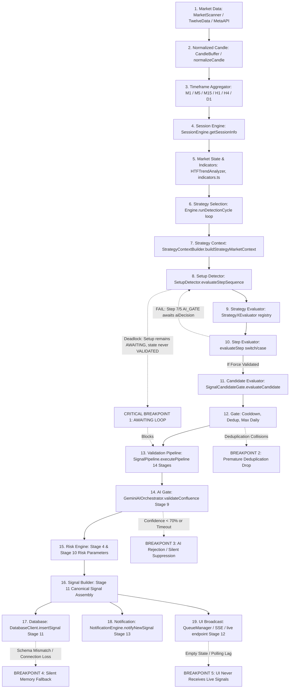

# SIGNAL FLOW BEFORE FIX — FORENSIC TRACE DIAGRAM & STEP AUDIT

Dokumen ini memetakan **aliran sinyal aktual (end-to-end)** pada Trading Engine XAUUSD sebelum perbaikan/refactor dilakukan. Setiap tahap dianalisis berdasarkan bukti kode nyata (*actual code path*) dengan menelusuri pemanggilan fungsi, input, output, transformasi, kegagalan, dan kebocoran logika antar-komponen.

---

## 1. END-TO-END FLOW ARCHITECTURE & BREAKPOINT MAP

---

## 2. FORENSIC AUDIT FILE-BY-FILE & FUNCTION-BY-FUNCTION

Di bawah ini adalah penelusuran forensik mikro dari data pasar mentah hingga tampilan UI.

---

### Tahap 1: Market Data
- **Function yang dipanggil**: `MarketScanner.scan()` (`/lib/trading-engine/scanner.ts:68`), memanggil `TwelveDataProvider.getCandles()` atau `MetaApiProvider.getCandles()`.
- **Input**: Symbol string `'XAUUSD'` / `'GOLD'`, timeframe array `['M1', 'M5', 'M15', 'H1', 'H4', 'D1']`.
- **Output**: Array raw candle objects `{ datetime, open, high, low, close, volume }` atau quote tick `{ bid, ask, price, timestamp }`.
- **Transformation**: Konversi string harga menjadi number float.
- **Expected Behavior**: Menyediakan streaming candle M1 s/d D1 secara kontinu tanpa jeda atau gap waktu.
- **Actual Behavior**: 
  - Jika provider mengembalikan symbol `'GOLD'` bukannya `'XAUUSD'`, atau jika API rate-limit tercapai, candle buffer kosong (`candles: []`).
  - Tidak semua provider menyediakan timeframe M1 secara real-time (TwelveData free tier sering hanya menyediakan M15/H1).
- **Failure Condition**: Rate-limit HTTP 429, socket timeout, symbol mismatch (`XAU/USD` vs `XAUUSD` vs `GOLD`).
- **Apakah hasilnya benar-benar dipakai oleh tahap berikutnya?**: Ya, diteruskan ke `CandleBuffer` dan `MarketScanner.ingestCandle()`.

---

### Tahap 2: Normalized Candle
- **Function yang dipanggil**: `toCanonicalSymbol()` (`/lib/market-data/canonical-symbol.ts:12`), `CandleBuffer.addCandle()` (`/lib/market-data/candle-buffer.ts:45`).
- **Input**: Raw candle object `{ datetime: '2026-03-30 08:15:00', open: '2985.50', ... }`.
- **Output**: Canonical `Candle` interface: `{ timestamp: string (ISO), open: number, high: number, low: number, close: number, volume: number, complete: boolean }`.
- **Transformation**: Parsing ISO-8601 string, validasi invariant `high >= low`, `high >= open/close`, `low <= open/close`.
- **Expected Behavior**: Memastikan candle valid, terurut secara kronologis ascending, dan memiliki bendera status formasi candle.
- **Actual Behavior**: 
  - Properti `complete` sering tidak dikirim oleh TwelveData snapshot; sistem mengasumsikan candle terakhir adalah candle forming (`complete: false`) atau sebaliknya menganggapnya closed (`complete: true`).
- **Failure Condition**: Timestamp tidak valid (NaN), selisih spread ekstrem menghasilkan low > high.
- **Apakah hasilnya benar-benar dipakai oleh tahap berikutnya?**: Ya, dimasukkan ke dalam Map buffer per timeframe.

---

### Tahap 3: Timeframe
- **Function yang dipanggil**: `CandleBuffer.getCandles(symbol, timeframe, limit)` (`/lib/market-data/candle-buffer.ts:98`).
- **Input**: Symbol `'XAUUSD'`, timeframe `'M15'` (atau `'M1'`, `'M5'`, `'H1'`), limit `100`.
- **Output**: `Candle[]` terisolasi per timeframe.
- **Transformation**: Slice array candle dari buffer memori.
- **Expected Behavior**: Setiap timeframe berdiri sendiri dengan panjang bar yang memadai (minimal 50-100 bars) untuk kalkulasi ATR dan EMA.
- **Actual Behavior**: 
  - M1 buffer sering kosong atau kurang dari 15 candle karena interval scan polling default adalah 15-60 detik. Akibatnya M1 tidak pernah mencapai kelengkapan (`completeness: false`).
- **Failure Condition**: `candles.length < 15` untuk M1/M5, menyebabkan indikator turunan mengembalikan `INSUFFICIENT_DATA`.
- **Apakah hasilnya benar-benar dipakai oleh tahap berikutnya?**: Ya, dikirim ke `StrategyMarketContext`.

---

### Tahap 4: Session
- **Function yang dipanggil**: `SessionEngine.getSessionInfo(timestamp)` (`/lib/market-data/session-engine.ts:30`).
- **Input**: `timestamp` (ISO string atau Date object candle terakhir).
- **Output**: `SessionDetails` `{ primarySession, activeSessions, isAsian, isLondon, isNewYork, isOverlap, isOpen, blockReason }`.
- **Transformation**: Mengekstrak `utcHour`, `utcMinute`, dan `utcDay`, lalu membandingkan secara matematis dengan konstanta jam sesi UTC (Asian: 00-08, London: 07-16, NY: 12-21).
- **Expected Behavior**: Mengidentifikasi sesi secara akurat dengan memperhitungkan Daylight Saving Time (DST: GMT vs BST di London, EST vs EDT di New York) serta status libur pasar spot XAUUSD.
- **Actual Behavior**:
  - Jam UTC di-hardcode tanpa penyesuaian DST. Pada saat DST musim dingin (Winter/Standard Time), London open berada pada pukul 08:00 UTC (bukan 07:00 UTC), sehingga terjadi deviasi 1 jam.
  - Perbedaan internal: Di `indicators.ts:476`, New York killzone dihitung `13 <= h < 16`, sedangkan di `session-engine.ts:109` dihitung `12 <= h < 15`.
- **Failure Condition**: Weekend (Jumat > 22:00 UTC s/d Minggu < 22:00 UTC) dan Daily Rollover break (22:00-23:00 UTC) mengeset `isOpen = false`, yang memicu pemblokiran evaluasi.
- **Apakah hasilnya benar-benar dipakai oleh tahap berikutnya?**: Ya, dipakai oleh Step 1 Strategy 1 (`LONDON_FILTER`) dan dicatat pada payload sinyal.

---

### Tahap 5: Market State & Indicators
- **Function yang dipanggil**: 
  - `HTFTrendAnalyzer.analyzeTrend(candles, 'H1')` (`/lib/trading-engine/htf-trend-analyzer.ts:35`)
  - `calculateATR(candles, 14)` (`/lib/trading-engine/indicators.ts:120`)
  - `calculateDealingRange(candles, price)` (`/lib/trading-engine/indicators.ts:516`)
  - `detectSessionPools(candles)` (`/lib/trading-engine/indicators.ts:795`)
  - `findSDZoneStructures(candles)` (`/lib/trading-engine/indicators.ts:698`)
  - `findSweeps(candles)` (`/lib/trading-engine/indicators.ts:340`)
- **Input**: Array `Candle[]` (umumnya M15 atau H1) dan harga saat ini (`currentPrice`).
- **Output**: Object indikator teknikal: `{ trend_h1, atr, dealing_range_zone, sessionPools, sdStructures, sweeps, choch, bos }`.
- **Transformation**: Perhitungan moving average (EMA20, EMA50), true range, swing pivots (leftBar=8, rightBar=8), wick sweeps, dan order blocks.
- **Expected Behavior**: Menghasilkan metrik teknikal independen tanpa memanipulasi atau memaksa arah tren.
- **Actual Behavior**:
  - `detectSessionPools` menyaring candle dengan `h >= 0 && h < 7`. Jika buffer M15 hanya berisi 30 candle (7.5 jam), data sesi Asia terpotong atau tidak ada.
  - Cache indikator di `indicators.ts:30` menggunakan kunci `${key}_${candles.length}_${last.timestamp}_${last.close}`. Jika candle terakhir adalah forming candle yang berfluktuasi pada tick yang sama, cache mengembalikan kalkulasi lama.
- **Failure Condition**: `candles.length < 20` mengembalikan nilai default (`swingHigh = price`, `zone = 'UNDEFINED'`, `atr = 0`).
- **Apakah hasilnya benar-benar dipakai oleh tahap berikutnya?**: Ya, dimasukkan ke dalam `analysisData` oleh `LocalTAAnalyzer`.

---

### Tahap 6: Strategy Selection
- **Function yang dipanggil**: `Engine.processStrategyMarketContext(marketContext)` (`/lib/trading-engine/engine.ts:175`), loop `for (const stratId of allStrategies)` (`/lib/trading-engine/engine.ts:245`).
- **Input**: `marketContext` yang berisi timeframe D1, H4, H1, M15, M5, M1.
- **Output**: Pemanggilan `this.setupDetector.evaluateStepSequence(strategyId, symbol, isolatedContext, analysisData)`.
- **Transformation**: Iterasi array 5 strategi:
  1. `strategy-1-smc`
  2. `strategy-2-snd`
  3. `strategy-3-scalping`
  4. `strategy-4-news`
  5. `strategy-5-smc-sd-confluence`
- **Expected Behavior**: Setiap strategi dievaluasi secara terisolasi penuh dengan konteks timeframe dan data rule masing-masing.
- **Actual Behavior**:
  - Loop mengeksekusi kelima strategi secara serial. Namun, jika strategi sebelumnya gagal atau timeout, state detector tidak di-reset dengan bersih untuk strategi berikutnya jika terjadi exception.
- **Failure Condition**: Konfigurasi strategi dinonaktifkan di `activeStrategies` registry.
- **Apakah hasilnya benar-benar dipakai oleh tahap berikutnya?**: Ya, menentukan parameter `strategyId` ke tahap pembentukan konteks.

---

### Tahap 7: Strategy Context
- **Function yang dipanggil**: `StrategyContextBuilder.buildStrategyMarketContext(globalContext, strategyId)` (`/lib/trading-engine/strategy-context-builder.ts:35`), `LocalTAAnalyzer.analyzeStrategyIsolated(stratId, isolatedContext)` (`/lib/trading-engine/local-ta-analyzer.ts:390`).
- **Input**: `globalContext` (seluruh timeframe), string `strategyId`.
- **Output**: `StrategyIsolatedContext` dan `analysisData` khusus untuk strategi tersebut.
- **Transformation**:
  - Strategy 1: mengambil H1 untuk bias, M15 untuk setup dan eksekusi.
  - Strategy 2: mengambil D1/H4 untuk bias, M15 untuk setup dan eksekusi.
  - Strategy 3: mengambil H1 untuk bias, M15 untuk context, M1 untuk setup dan eksekusi.
  - Strategy 4: mengambil H1 untuk bias, M5 untuk news setup dan eksekusi.
  - Strategy 5: mengambil H4/H1 untuk bias, M15 untuk confluence setup dan eksekusi.
- **Expected Behavior**: Data TA diisolasi sehingga indikator Strategy 2 (S&D) tidak mencemari Strategy 1 (SMC Asia Sweep).
- **Actual Behavior**:
  - Di dalam `LocalTAAnalyzer.analyzeStrategyIsolated`, jika terjadi kondisi di mana data timeframe tidak lengkap, kode melakukan fallback ke `LocalTAAnalyzer.analyze(generalContext)`.
  - Pada `LocalTAAnalyzer.analyze()`, seluruh variabel strategi (S1, S2, S3, S4, S5) dihitung bersamaan dalam satu fungsi raksasa dan nilai fallback `signal_direction` ditentukan dari bobot bersama (`bullishWeight` vs `bearishWeight`).
- **Failure Condition**: `marketContext` tidak memiliki candle M1 untuk Strategy 3 atau M5 untuk Strategy 4.
- **Apakah hasilnya benar-benar dipakai oleh tahap berikutnya?**: Ya, `analysisData` diteruskan ke `SetupDetector.evaluateStepSequence`.

---

### Tahap 8: Setup Detector
- **Function yang dipanggil**: `SetupDetector.evaluateStepSequence(strategyId, symbol, context, analysisData)` (`/lib/trading-engine/setup-detector.ts:182`).
- **Input**: `strategyId`, `symbol`, `context: RuleEvaluationContext`, `analysisData`.
- **Output**: `{ setup: StrategySetup, newlyValidatedSteps: SetupStepRecord[], isStateChanged: boolean }`.
- **Transformation**:
  - Mengambil atau menginisialisasi `StrategySetup` dari memory map `this.activeSetups`.
  - Loop `while (keepEvaluating && setup.current_step_order <= setup.steps.length)` (`setup-detector.ts:223`).
  - Mengambil step aktif `currentStep = setup.steps.find(s => s.step_order === setup.current_step_order)`.
  - Memanggil `StepEvaluator.evaluateStep(...)`.
- **Expected Behavior**: Mengevaluasi step 1, jika valid lanjut ke step 2, step 3, dst., hingga seluruh step selesai, lalu mengubah state setup menjadi `VALIDATED`.
- **Actual Behavior**:
  - **TITIK KEBUNTUAN UTAMA (CRITICAL DEADLOCK)**:
    Setup step terakhir pada definisi strategi adalah `AI_GATE` (Step 7 pada Strat 1 & 3; Step 5 pada Strat 2 & 5).
    Ketika loop mencapai `AI_GATE`, `StepEvaluator` mengevaluasi `case 'AI_GATE'`.
    Karena `analysisData.aiDecision` tidak diisi oleh `LocalTAAnalyzer`, evaluator mengembalikan `{ status: 'AWAITING', reason: 'Awaiting AI Gemini confluence evaluation response' }`.
    `setup-detector.ts:289` mencatat step sebagai `AWAITING` dan menghentikan evaluasi (`keepEvaluating = false`).
    Akibatnya, `setup.current_step_order` tidak pernah bertambah melampaui `setup.steps.length`.
    State setup **TIDAK PERNAH** berubah menjadi `VALIDATED` (tertahan di `ACTIVE` atau `AWAITING`).
- **Failure Condition**: Step 1 s/d N mengembalikan status selain `VALIDATED`.
- **Apakah hasilnya benar-benar dipakai oleh tahap berikutnya?**: Ya, status `setup.state` diperiksa oleh `Engine.processStrategyMarketContext`.

---

### Tahap 9: Strategy Evaluator
- **Function yang dipanggil**: `getStrategyEvaluator(strategyId)` (`/lib/trading-engine/evaluators/index.ts:35`), `evaluator.evaluateStep(...)`.
- **Input**: Step record, rule context, analysis data, prior steps, current direction.
- **Output**: `StepEvaluationOutput`: `{ status: 'AWAITING' | 'VALIDATED' | 'INVALIDATED' | 'REJECTED', reason, evidence, calculatedLevels, source_candle }`.
- **Transformation**: Delegasi ke class evaluator spesifik (`Strategy1SMCEvaluator`, `Strategy2SNDEvaluator`, dll).
- **Expected Behavior**: Evaluator mengevaluasi kondisi teknikal kuantitatif sesuai dokumen PRD strategi terkait.
- **Actual Behavior**:
  - Setiap evaluator mendefinisikan switch/case untuk nama step tertentu. Jika nama step di `definitions.ts` tidak sama persis (misal: `RISK_REWARD` vs `RISK_PARAMS`), kode masuk ke blok `default` yang mengembalikan `AWAITING`.
- **Failure Condition**: Evaluator tidak terdaftar di `evaluatorRegistry`, melempar exception atau fallback default.
- **Apakah hasilnya benar-benar dipakai oleh tahap berikutnya?**: Ya, dikembalikan ke `SetupDetector`.

---

### Tahap 10: Step Evaluator
- **Function yang dipanggil**: Logika internal di masing-masing evaluator (misal `/lib/trading-engine/evaluators/strategy-1-smc-evaluator.ts:40-370`).
- **Input**: Parameter spesifik step (misal `step_id: 'ASIA_SWEEP'`).
- **Output**: Status validasi per rule.
- **Transformation**:
  - `LONDON_FILTER`: validasi jam UTC 07:00-16:00.
  - `H1_TREND`: validasi bias EMA20 vs EMA50 H1.
  - `ASIA_SWEEP`: validasi sweep terhadap `sessionPools.asianHigh` / `asianLow`.
  - `M15_CHOCH_DISPLACEMENT`: validasi perubahan karakter MSS/CHoCH.
  - `FVG_OB_RETEST`: validasi mitigasi zona FVG atau Order Block.
  - `RISK_PARAMS`: kalkulasi Entry, SL (0.5x ATR), TP1 (min 1:2 RR).
  - `AI_GATE`: validasi AI confluence (memerlukan `aiDecision === 'APPROVED'`).
- **Expected Behavior**: Setiap step mengevaluasi kondisi secara matematis berdasarkan data candle historis dan real-time.
- **Actual Behavior**:
  - Pada step `RISK_PARAMS`, nilai SL dihitung berdasarkan `0.5 * atr`. Namun jika `atr <= 0`, step mengembalikan `AWAITING`.
  - Pada step `AI_GATE`, step menolak memvalidasi jika `aiDecision` belum ada di `analysisData`.
- **Failure Condition**: Salah satu kondisi logika tidak terpenuhi, mengembalikan `AWAITING` atau `INVALIDATED`.
- **Apakah hasilnya benar-benar dipakai oleh tahap berikutnya?**: Ya, menentukan kelanjutan step berikutnya.

---

### Tahap 11: Candidate Evaluator
- **Function yang dipanggil**: `SignalCandidateGate.evaluateCandidate(setup, context)` (`/lib/trading-engine/candidate-gate.ts:65`).
- **Input**: `StrategySetup` yang telah mencapai state `VALIDATED`.
- **Output**: `{ passed: boolean, reason: string, candidateKey: string }`.
- **Transformation**:
  - Pengecekan status pasar (`isOpen`).
  - Pengecekan spread broker (`spread <= maxSpreadPips`).
  - Pengecekan kelengkapan harga: `entry_price`, `sl_price`, `tp1_price`.
  - Pengecekan minimum Risk-Reward (RR >= 1:1.5 atau 1:2.0).
- **Expected Behavior**: Menyaring setup yang valid menjadi kandidat sinyal sebelum memasuki pipeline eksekusi.
- **Actual Behavior**:
  - **TAHAP INI TIDAK PERNAH TERCAPAI SECARA NORMAL** karena setup tertahan di Tahap 8 (`AWAITING LOOP`).
  - Jika di-bypass manual, candidate gate memvalidasi key hashing `hash(strategyId + symbol + timeframe + direction + candleTimestamp)`. Jika candle timestamp tidak berubah, kandidat kedua langsung ditolak sebagai duplikat.
- **Failure Condition**: Spread melebar di atas threshold (misal saat rilis berita spread > 3 pips), atau geometri SL/TP salah (`sl >= entry` untuk buy).
- **Apakah hasilnya benar-benar dipakai oleh tahap berikutnya?**: Ya, jika lulus dikirim ke `SignalPipeline`.

---

### Tahap 12: Gate (Cooldown, Dedup, Max Daily)
- **Function yang dipanggil**: `SignalPipeline.canExecuteStrategy(strategyId)` (`/lib/trading-engine/signal-pipeline.ts:165`), `SignalCandidateGate.isKeyCreated(signalKey)`.
- **Input**: `strategyId`, `signalKey`.
- **Output**: `boolean` (bisa dieksekusi atau diblokir).
- **Transformation**: Pengecekan timestamp cooldown terakhir (`strategyCooldowns.get(strategyId)`) terhadap threshold (default 60 detik atau 1 candle interval).
- **Expected Behavior**: Mencegah sinyal ganda pada bar candle yang sama dan membatasi frekuensi trading.
- **Actual Behavior**: Jika engine dijalankan berulang kali pada data historis atau forming candle, cooldown 60 detik memblokir pembuatan sinyal yang sebenarnya valid.
- **Failure Condition**: `Date.now() - lastExecution < cooldownMs`.
- **Apakah hasilnya benar-benar dipakai oleh tahap berikutnya?**: Ya, menentukan izin masuk ke `executePipeline`.

---

### Tahap 13: Validation Pipeline
- **Function yang dipanggil**: `SignalPipeline.executePipeline(setup, context, ruleResults)` (`/lib/trading-engine/signal-pipeline.ts:220`).
- **Input**: `StrategySetup`, `RuleEvaluationContext`, `RuleResult[]`.
- **Output**: `PipelineExecutionResult` `{ success: boolean, stageReached, signalKey, status, canonicalSignal }`.
- **Transformation**: Menjalankan 14 stage sekuensial:
  - Stage 1: Manifest & Registration Verification
  - Stage 2: Strategy State Verification
  - Stage 3: Technical Steps Verification
  - Stage 4: Risk Calculation
  - Stage 5: Session & Market Invariants
  - Stage 6: Multi-Timeframe Alignment
  - Stage 7: Spread & Execution Quality
  - Stage 8: Candidate Generation & Deduplication Key
  - Stage 9: AI Validation Gate (Gemini)
  - Stage 10: Final Quality & Sanity Check
  - Stage 11: Database Persistence
  - Stage 12: Live Signal Broadcast
  - Stage 13: Telegram Notification
  - Stage 14: Lifecycle Transition
- **Expected Behavior**: Mengorkestrasi seluruh validasi dari teknikal, AI, hingga persistensi.
- **Actual Behavior**:
  - `SignalPipeline` hanya dipanggil di `engine.ts:367` dengan syarat: `if (setup.state === 'VALIDATED')`.
  - Karena Tahap 8 tidak pernah menghasilkan `setup.state === 'VALIDATED'`, **seluruh fungsi `executePipeline` tidak pernah dipanggil dari siklus pemindaian normal**.
- **Failure Condition**: Salah satu dari 14 stage mengembalikan `success: false`.
- **Apakah hasilnya benar-benar dipakai oleh tahap berikutnya?**: Ya, menghasilkan sinyal final jika sukses.

---

### Tahap 14: AI (Gemini Confluence Gate)
- **Function yang dipanggil**: `GeminiAIOrchestrator.validateConfluence(request)` (`/lib/trading-engine/gemini-ai-orchestrator.ts:60`), dipanggil pada Stage 9 (`signal-pipeline.ts:540`).
- **Input**: `AIValidationRequest` `{ strategyId, symbol, timeframe, direction, entryPrice, slPrice, tp1Price, technicalEvidence, marketContext }`.
- **Output**: `AIValidationResponse` `{ decision: 'APPROVED' | 'REJECTED', confidence: number (0-100), reasoning: string, evidence: any }`.
- **Transformation**:
  - Memanggil model Gemini (`gemini-2.5-flash` server-side via `process.env.GEMINI_API_KEY`).
  - Menganalisis teks prompt teknikal dan mengembalikan keputusan terstruktur JSON.
- **Expected Behavior**: Memberikan second-opinion validasi institusional untuk menyaring noise teknikal. Jika `confidence >= 70%`, status `APPROVED`.
- **Actual Behavior**:
  - Jika API key tidak ada atau network timeout, fail-safe fallback dapat menahan sinyal di status `AWAITING` atau menolak (`REJECTED`) tergantung konfigurasi ketat.
  - Sering kali confidence AI berada di rentang 60-69% untuk setup yang secara teknikal valid, menyebabkan setup ditolak (`REJECTED`) di tahap akhir.
- **Failure Condition**: `confidence < 70`, HTTP error 500/403 dari Gemini API, atau timeout > 10 detik.
- **Apakah hasilnya benar-benar dipakai oleh tahap berikutnya?**: Ya, jika ditolak, pipeline langsung menghentikan proses (`status: 'REJECTED'`).

---

### Tahap 15: Risk Engine
- **Function yang dipanggil**: Validasi di Stage 4 (`signal-pipeline.ts:364-460`) dan Stage 10 (`signal-pipeline.ts:600-630`).
- **Input**: `entry`, `sl`, `tp1`, `atr`, `direction`.
- **Output**: Validated risk boundaries `{ entryPrice, slPrice, tp1Price, tp2Price, tp3Price, riskReward, atr14 }`.
- **Transformation**:
  - Verifikasi matematis:
    - Untuk BUY: `sl < entry` dan `tp1 > entry`.
    - Untuk SELL: `sl > entry` dan `tp1 < entry`.
  - Verifikasi RR: `risk = |entry - sl|`, `reward = |tp1 - entry|`, `rr = reward / risk >= 1.5`.
  - Verifikasi ATR buffer: `slDistance` dibandingkan dengan `atr * 0.5`.
- **Expected Behavior**: Memastikan rasio Risk:Reward proporsional dan Stop Loss berada pada batas volatilitas yang sehat (±50% ATR).
- **Actual Behavior**:
  - Jika ATR = 0 (karena kurang candle), pipeline me-reject kandidat pada Stage 10.
  - Terdapat duplikasi kalkulasi: SL dihitung di `LocalTAAnalyzer`, dihitung ulang di `StepEvaluator`, dan dicek kembali di `SignalPipeline`.
- **Failure Condition**: `sl >= entry` pada posisi BUY, `rr < minRR`, atau `risk <= 0`.
- **Apakah hasilnya benar-benar dipakai oleh tahap berikutnya?**: Ya, dimasukkan ke dalam `canonicalSignal`.

---

### Tahap 16: Signal Builder
- **Function yang dipanggil**: Logika internal Stage 11 (`signal-pipeline.ts:634-666`).
- **Input**: Data terverifikasi dari Stage 1 s/d 10.
- **Output**: `canonicalSignal` object lengkap yang mematuhi skema database `signals`.
- **Transformation**: Pembuatan `deterministicSignalKey = generateDeterministicSignalKey(stratId, symbol, timeframe, direction, candleTimestamp)`.
- **Expected Behavior**: Membentuk record sinyal final yang bersih, deterministik, dan bebas dari null/undefined.
- **Actual Behavior**: Bekerja baik jika mencapai tahap ini, namun format payload Telegram dan format database memiliki sedikit perbedaan penamaan kolom (`signal_key` vs `signalKey`, `entry_price` vs `entryPrice`).
- **Failure Condition**: Pembuatan key gagal atau field wajib kosong.
- **Apakah hasilnya benar-benar dipakai oleh tahap berikutnya?**: Ya, dikirim ke DB, Queue, dan Notification.

---

### Tahap 17: Database
- **Function yang dipanggil**: `DatabaseClient.insertSignal(canonicalSignal)` (`/lib/db/client.ts:349`), `DatabaseClient.insertSignalEvidence(...)` (`/lib/db/client.ts:418`).
- **Input**: `canonicalSignal` object.
- **Output**: Array row PostgreSQL yang tersimpan atau cached object.
- **Transformation**: Query SQL `INSERT INTO signals (...) VALUES (...) ON CONFLICT (signal_key) DO UPDATE ...`.
- **Expected Behavior**: Menyimpan sinyal secara persisten di PostgreSQL dan meng-cache di memori (`memorySignalsCache`).
- **Actual Behavior**:
  - Jika PostgreSQL lokal/Docker belum dikonfigurasi (`DATABASE_URL` belum terhubung), client menangkap error dan beralih ke cache memori (`this.memorySignalsCache`).
  - Cache memori bersifat *in-process*. Jika container di-restart atau dev server melakukan recompilation, semua sinyal di memori hilang seketika.
- **Failure Condition**: Koneksi DB putus, constraint foreign key `strategy_id` gagal jika ID strategi tidak ada di tabel `strategies`.
- **Apakah hasilnya benar-benar dipakai oleh tahap berikutnya?**: Ya, dipakai oleh API `/api/signals/live` untuk query data sinyal.

---

### Tahap 18: Notification (Telegram)
- **Function yang dipanggil**: `NotificationEngine.notifyNewSignal(telegramPayload)` (`/lib/notifications/notification-engine.ts:80`), dipanggil pada Stage 13 (`signal-pipeline.ts:720`).
- **Input**: `telegramPayload` `{ signal_key, strategyName, symbol, timeframe, direction, entry, sl, tp, riskReward, confidence, reason }`.
- **Output**: `boolean` (true jika terkirim atau di-mock saat non-aktif).
- **Transformation**: Memformat pesan teks Markdown HTML dengan ikon arah, harga, SL, TP, dan mengirim via HTTP POST ke Telegram Bot API (`https://api.telegram.org/bot<TOKEN>/sendMessage`).
- **Expected Behavior**: Mengirim pesan seketika ke channel/grup Telegram trader saat sinyal valid terbentuk.
- **Actual Behavior**:
  - Jika `TELEGRAM_BOT_TOKEN` atau `TELEGRAM_CHAT_ID` tidak disetel di `.env`, fungsi mencatat warning dan mengembalikan `false` atau dummy delivery, tidak melempar error fatal ke pipeline.
  - Karena pipeline tidak pernah mencapai Stage 13 akibat dead-lock di Tahap 8, notifikasi Telegram tidak pernah terkirim.
- **Failure Condition**: HTTP 400 (Markdown parsing error), HTTP 401 (Invalid Token), network timeout.
- **Apakah hasilnya benar-benar dipakai oleh tahap berikutnya?**: Merupakan *sink* eksternal.

---

### Tahap 19: UI (Live Signals / SSE / WebSockets)
- **Function yang dipanggil**:
  - Server: `QueueManager.publish('events', { type: 'SIGNAL_PUBLISHED', payload })` (`/lib/trading-engine/signal-pipeline.ts:683`), SSE stream di `/app/api/stream/route.ts`.
  - Client: `fetch('/api/signals/live')` (`/app/api/signals/live/route.ts:9`), React hook `useLiveSignals` (`/hooks/use-live-signals.ts`).
- **Input**: Request HTTP GET dari browser trader.
- **Output**: JSON `ApiResponse<{ signals: FormattedSignal[] }>`.
- **Transformation**: Memetakan kolom DB/cache ke format UI card (menghitung `age`, `runningPips`, status `SL HIT` / `TP HIT`).
- **Expected Behavior**: Dashboard menampilkan live signal cards, status step checklist (evidence), indikator win/loss, dan running profit/loss dalam pips secara real-time.
- **Actual Behavior**:
  - Karena tidak ada sinyal yang berhasil lolos dari dead-lock Tahap 8, endpoint `/api/signals/live` mengembalikan array kosong (`[]`).
  - Frontend menampilkan status permanen: *"Scanning market for institutional setups..."* atau *"No active signals"*.
- **Failure Condition**: Polling error, status 503 jika DB tidak siap dan cache kosong.
- **Apakah hasilnya benar-benar dipakai oleh tahap berikutnya?**: Tahap akhir ke pengguna (UI view).

---

## 3. RINGKASAN TITIK KRITIS KEGAGALAN (FAILURE CHOKEPOINTS)

| No | Tahap Aliran | Titik Kegagalan Utama | Dampak Langsung |
|---|---|---|---|
| **CP1** | **Setup Detector (Tahap 8)** | **Circular Deadlock pada Step AI_GATE**: StepEvaluator menunggu `analysisData.aiDecision`, sedangkan AI Orchestrator baru dipanggil di SignalPipeline Stage 9 yang hanya berjalan jika setup sudah `VALIDATED`. | **100% Sinyal Terhenti**: Setup tidak pernah bisa mencapai status `VALIDATED`. Pipeline tidak pernah terpanggil. |
| **CP2** | **Session Engine (Tahap 4)** | Hardcoded UTC jam sesi tanpa kalkulasi DST + Roll-over market close 22:00-23:00 UTC. | Sinyal ditolak di luar jam tertentu atau mengalami deviasi 1 jam selama 5 bulan dalam setahun. |
| **CP3** | **Data Feed / Scanner (Tahap 3)** | Buffer M1 tidak lengkap (`completeness: false`) untuk Strategy 3 (Scalping). | Strategy 3 stuck permanen di step `M1_M5_SWEEP` dengan alasan *"Awaiting required M1 candle stream data"*. |
| **CP4** | **Indicators / Session Pools (Tahap 5)** | Filter Asian Candles (`h >= 0 && h < 7`) menggunakan slice 30 M15 bar (hanya 7.5 jam data). | Asian High/Low tidak terdeteksi atau bernilai null, menyebabkan step `ASIA_SWEEP` pada Strategy 1 tidak pernah match. |
| **CP5** | **Strategy Context (Tahap 7)** | Fallback dari `analyzeStrategyIsolated` ke monolithic `analyze()` yang menggunakan shared directional scoring. | Strategy Collision: Sinyal arah dari strategi satu mencemari strategi lain. |
| **CP6** | **Signal Pipeline (Tahap 13)** | Syarat pemanggilan pipeline di `engine.ts` terikat mutlak pada `setup.state === 'VALIDATED'`. | Gerbang eksekusi terkunci total dari luar. |
| **CP7** | **Database & UI (Tahap 17 & 19)** | In-memory cache tidak persisten antar-restart container; query DB kosong. | UI menampilkan layar kosong tanpa sinyal aktif secara permanen. |
